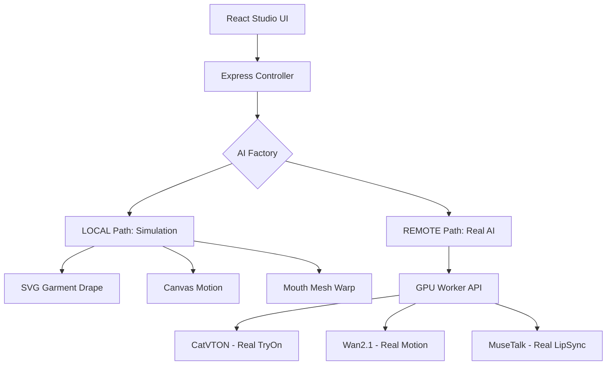

# Architecture Target (Phase 2): Split-Runtime Modular Studio

## Key Updates
1.  **Security**: Secrets moved to `server/.env`.
2.  **State**: Backend now manages the job queue for Real AI jobs.
3.  **Persistence**: Intermediate assets (Real VTO images, Clips) stored on server or Firebase Storage.
