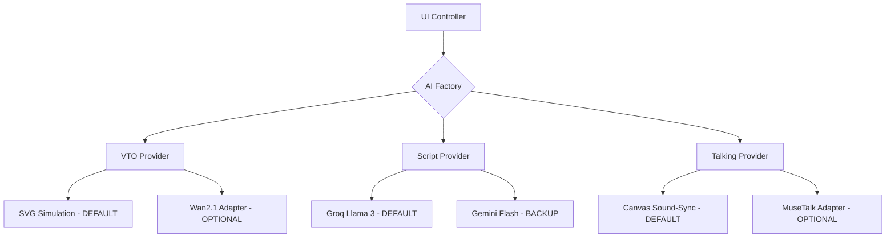

# Target Architecture: Modular Fashion Studio

The existing monolithic controller will be refactored into a **Provider-Based Architecture**.

## Key Interfaces
- `generateTryOn(product, model)`
- `generateTalkingShot(video, audio)`
- `exportMP4(canvasStream)`
